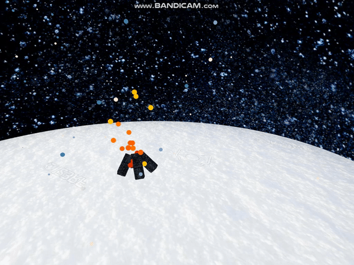

# Particle System

## Table of contents
* [General info](#general-info)
* [Technologies](#technologies)
* [Illustrations](#illustrations)
* [Setup](#setup)

## General info
Implementation of the molecular system using the basic equations of motion (Euler integration, Stokes law) with sound and graphic effects.

## Technologies
Project is created with:
* C++ 17
* openFrameworks 0.11.0

## Illustrations
* Short video showing how the application works

## Setup
On the home page of [openFrameworks](https://openframeworks.cc/download/) you will find everything you need to compile on your system.
